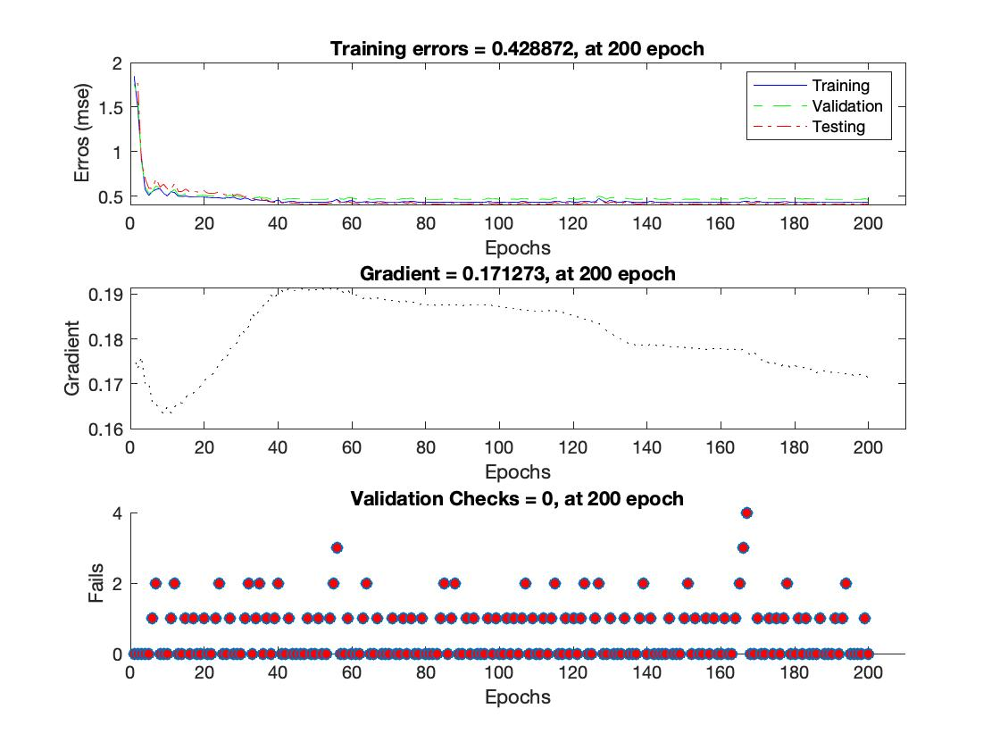

# Back Propagation Neural Network
This tool is intended to implement back-propagation algorithm with momentum 
for multi-layer perceptron(MLP) neural networks.

## Requirements
+ Running environment: [MATLAB R2019a] or above, The MathWorks, Inc. 

## Usage

### Data Preparation 
Before starting with this tool, you should make sure that each folder 
in this tool have been add to MATLAB search path by using `addpath()`. 
A folder `/utils` includes all necessary functions of implementation of
back-propagation algorithm with momentum. As to `/src/data`, it holds
a test dataset graping from a `y=sine(x)` function, which has only one 
input variable as well as its output, where x is randomly sampled in a range
`(-2pi, 2pi)`. If you would like to rescale this range, please go to 
`/src/common` folder for specifying it to your desired values
in `grap_data_from_sine.m`. For `/test`, it makes an attempt to fit
those data points to demonstrate how this tool works. 

### Parameter Setting
This tool provides a flexible way to set key parameters for neural networks(NNs). 
To create an NN with a given architecture, use 
```
    net = nncreate(hiddenLayerSize);
```
where `hiddenLayerSize` specifies a sort of NN's architecture using an array, e.g.,
`hiddenLayerSize = [20 10 20]`, each element within the array is the number of 
the neurons on the corresponding layer. To specify moment coefficient(`mc`),
learning rate(`lr`), goal(`goal`), maximum number of iteration(`epoch`) for NNs, use
```
    net.trainParam.mc = 0.95;
    net.trainParam.lr = 0.7;
    net.trainParam.goal = 1e-6;
    net.trainParam.epoch = 200;
```
This tool also supports three types of data division like MATLAB, (`divideint`|`dividerand`|`divideblock`)
because it actually call MATLAB's built-in functions for data division. By default, 
```
    net.divideFcn = 'dividerand';
```
it uses `dividerand` to perform data split. It is easy to parse one of 
the other supported methods to `net.divideFcn` to change the way to split data set.
If you would like to monitor overall network at each iteration, 
just set `net.trainParam.showWindow = true`, it will report NN's errors and gradients in a figure,
even how many times it consecutively isolates validation checking. However, this will
sharply increase computational cost. An good practice is to turn off `net.trainParam.showWindow`
but turn on `net.trainParam.showCommandLine`.

### Showcase: Sine
Running  `sine_demo.m` coming after setting a group of parameters,
you might have a graphic footage depicting errors and gradients 
curves against iteration number for training process.

[//]: <> 'cite a figure in HTML style'
<p align="center">
 
    <br>
    <em>Figure 1 Training process of NN against epochs.</em>
</p>

    
[//]: <> 'The following are cited URLs'
[MATLAB R2019a]: https://www.mathworks.com/downloads/
